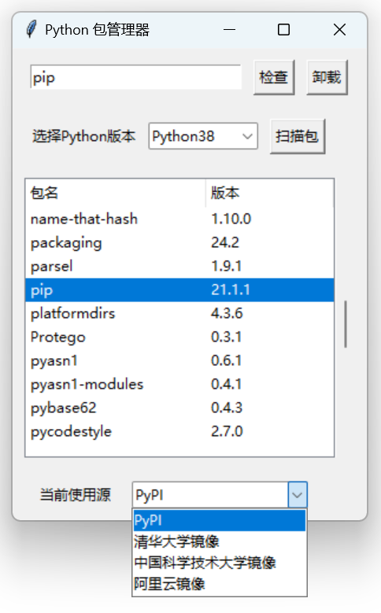

# Python 包管理器

（PyPM - Python Package Manager）

提供 Python 包扫描和基本的管理功能

## 使用

有打包好的 Win64 版本的 exe 可执行文件，当然也可以下载源代码 `PyPM_UI.py` 在 Windows 的 Python 环境下运行

## 特色

- 一键检查 **更新** 和 **卸载**
- 可以管理 **多版本** Python 的包
- 列表展示所有已安装包及 **版本**
- 支持使用国内主流 **镜像源**
- 拥有较友好的 **UI 界面**

## 运行图

## 反馈

如发现 bug 或有问题等欢迎提交 Issues

## 其他

**代码贡献度**：DeepSeek 99% + 我自己 1%

**后续开发计划**：考虑加上添加自定义镜像源功能，增加不同版本以适配不同的操作系统等等（目前没更多好的点子了），如果这个东西真的有用帮到很多人的话

# Python Package Manager

（PyPM - Python Package Manager）

Provides Python package scanning 和 basic management features

## 使用

There is a packaged Win64 version of the executable, 和 of course you can also download the source code 'PyPM_UI.py' to run it in the Windows Python environment

## Features

- One-click check **更新** 和 **Uninstall**
- Can manage packages for multiple versions of Python
- List of all installed packages and **versions**
- Support the use of domestic mainstream **Image source**
- Have a more user-friendly **UI**

## Feedback

If you find a bug or have a problem, please submit an issue

## Others

**Follow-up development plan:** Consider adding the ability to add custom image sources, adding different versions to adapt to different operating systems, etc. (there are no more good ideas at the moment), if this thing is really useful 和 helps a lot of people
